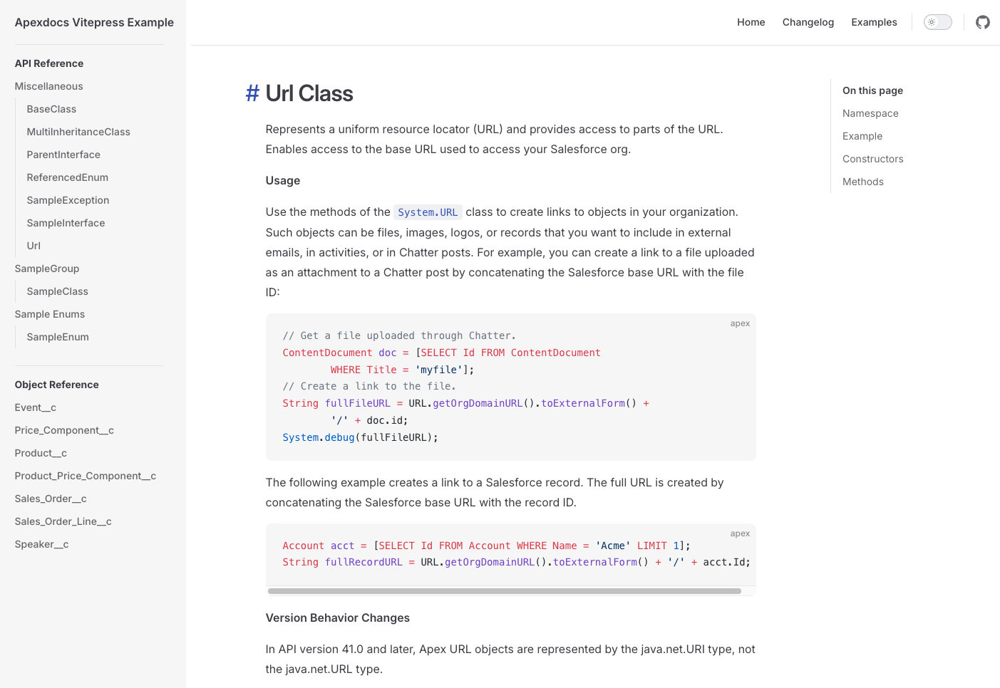
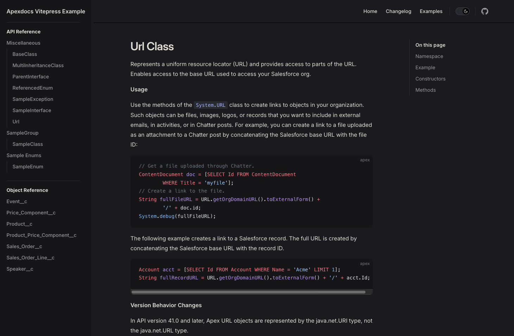
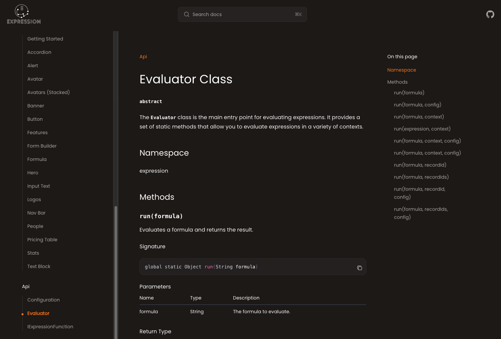
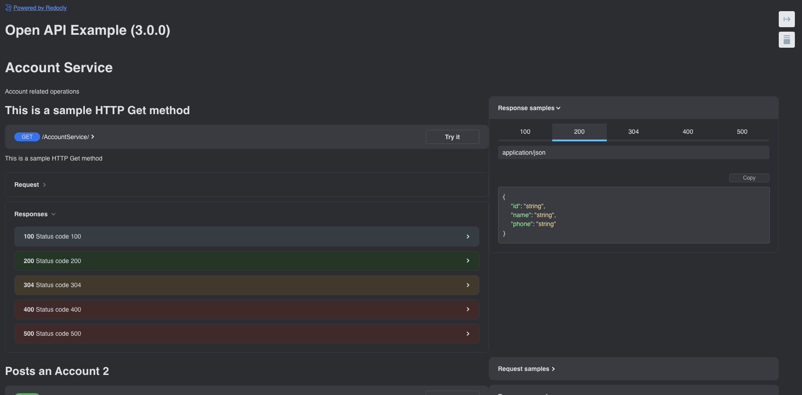

# ApexDocs

<div align="center">
  <b>CLI and Node library to generate documentation for Salesforce Apex classes.</b>

[](https://github.com/cesarParra/apexdocs/actions/workflows/ci.yaml)
[](https://github.com/cesarParra/apexdocs/blob/master/LICENSE)
[](https://www.npmjs.com/package/@cparra/apexdocs)
</div>

ApexDocs is a non-opinionated documentation generator for Salesforce Apex classes.
It can output documentation in Markdown format, which allows you to use the Static Site Generator of your choice to
create a documentation site that fits your needs, hosted in any static web hosting service.

## Table of Contents

- [👀 Examples](#-examples)
- [🚀 Features](#-features)
- [💿 Installation](#-installation)
- [⚡ Quick Start](#-quick-start)
    - [CLI](#cli)
        - [Markdown](#markdown)
        - [OpenApi](#openapi)
        - [Changelog](#changelog)
- [▶️ Available Commands](#️-available-commands)
    - [Markdown](#markdown-1)
    - [OpenApi](#openapi-1)
    - [Changelog](#changelog-1)
- [🔬 Defining a configuration file](#-defining-a-configuration-file)
- [🌐 Translation](#-translation)
- [⤵︎ Importing to your project](#︎-importing-to-your-project)
- [📖 Documentation Guide](#-documentation-guide)
- [📄 Generating OpenApi REST Definitions](#-generating-openapi-rest-definitions)

## 👀 Examples

ApexDocs generates Markdown files, which can be integrated into any Static Site Generation (SSG) engine,
(e.g. Jekyll, Vitepress, Hugo, Docosaurus, etc.) to create a documentation site that fits your needs.

This gives you the flexibility to create beautiful sites by leveraging your preferred SSG engine, which
usually provides a wide range of themes, dark mode support, and other features out of the box.

<div align="center">
  
  
</div>

*These are examples of documentation sites generated using Vitepress.
Head over to the `examples/vitepress` folder to see the code.*

The extra flexibility also lets you integrate the output documentation with your existing documentation site,
allowing you to match the look and feel of your existing site.

<div align="center">
    
</div>

OpenApi REST definitions can be visualized using a tool like ReDoc, Swagger UI, or any other OpenApi viewer.

<div align="center">
    
</div>

This repo contains several other example implementations in the `examples` directory, showcasing how to integrate
with different tools.

* [Examples](./examples)

### In the wild

Here are some live projects using ApexDocs:

- [Trailhead Apex Recipes](https://github.com/trailheadapps/apex-recipes)
- [Salesforce Commerce Apex Reference](https://developer.salesforce.com/docs/commerce/salesforce-commerce/references/comm-apex-reference/cart-reference.html)
- [Expression (API)](https://cesarparra.github.io/expression/)
- [Nimble AMS Docs](https://nimbleuser.github.io/nams-api-docs/#/api-reference/)

## 🚀 Features

* Generate documentation for Salesforce code (Apex, triggers, custom objects, LWCs) as Markdown files
* Generate an OpenApi REST specification based on `@RestResource` classes
* Generate a changelog based on the differences between two versions of your Salesforce Apex classes
* Support for grouping blocks of related code within a class
* Support for ignoring files and members from being documented
* Namespace support
* Configuration file support
* Translation support for different languages and custom terminology
* Single line ApexDoc Blocks
* Custom tag support
* And much, much more!

## 💿 Installation

```bash
npm i -g @cparra/apexdocs
```

## ⚡ Quick Start

### CLI

#### Markdown

Run the following command to generate markdown files for your global Salesforce Apex classes and custom objects:

```bash
apexdocs markdown -s force-app

# Use sfdx-project.json as the source of directories
apexdocs markdown --useSfdxProjectJson

# Specify multiple source directories
apexdocs markdown --sourceDir force-app force-lwc force-utils
```

#### OpenApi

Run the following command to generate an OpenApi REST specification for your Salesforce Apex classes
annotated with `@RestResource`:

```bash
apexdocs openapi -s force-app
```

#### Changelog

Run the following command to generate a changelog for your Salesforce Apex classes:

```bash
apexdocs changelog --previousVersionDir force-app-previous --currentVersionDir force-app
```

## ▶️ Available Commands

### Markdown

`markdown`

#### Flags

| Flag                              | Alias | Description                                                                                                                                                                                              | Default          | Required |
|-----------------------------------|-------|----------------------------------------------------------------------------------------------------------------------------------------------------------------------------------------------------------|------------------|----------|
| `--sourceDir`                     | `-s`  | The directory or directories where the source files are located.                                                                                                                                         | N/A              | *        |
| `--useSfdxProjectJson`            | N/A   | Read source directories from `sfdx-project.json` packageDirectories. Cannot be used with `--sourceDir`.                                                                                                  | `false`          | *        |
| `--sfdxProjectPath`               | N/A   | Path to directory containing `sfdx-project.json` (defaults to current directory). Only used with `--useSfdxProjectJson`.                                                                                 | `process.cwd()`  | No       |
| `--targetDir`                     | `-t`  | The directory where the generated files will be placed.                                                                                                                                                  | `docs`           | No       |
| `--scope`                         | `-p`  | A list of scopes to document. Values should be separated by a space, e.g --scope global public namespaceaccessible.                                                                                      | `[global]`       | No       |
| `--customObjectVisibility`        | `-v`  | Controls which custom objects are documented. Values should be separated by a space.                                                                                                                     | `[public]`       | No       |
| `--defaultGroupName`              | N/A   | The default group name to use when a group is not specified.                                                                                                                                             | `Miscellaneous`  | No       |
| `--namespace`                     | N/A   | The package namespace, if any. If provided, it will be added to the generated files.                                                                                                                     | N/A              | No       |
| `--sortAlphabetically`            | N/A   | Sorts files appearing in the Reference Guide alphabetically, as well as the members of a class, interface or enum alphabetically. If false, the members will be displayed in the same order as the code. | `false`          | No       |
| `--includeMetadata `              | N/A   | Whether to include the file's meta.xml information: Whether it is active and the API version                                                                                                             | `false`          | No       |
| `--linkingStrategy`               | N/A   | The strategy to use when linking to other classes. Possible values are `relative`, `no-link`, and `none`                                                                                                 | `relative`       | No       |
| `--customObjectsGroupName`        | N/A   | The name under which custom objects will be grouped in the Reference Guide                                                                                                                               | `Custom Objects` | No       |
| `--triggersGroupName`             | N/A   | The name under which triggers will be grouped in the Reference Guide                                                                                                                                     | `Triggers`       | No       |
| `--lwcGroupName`                  | N/A   | The name under which Lightning Web Components will be grouped in the Reference Guide                                                                                                                     | `Triggers`       | No       |
| `--includeFieldSecurityMetadata`  | N/A   | Whether to include the compliance category and security classification for fields in the generated files.                                                                                                | `false`          | No       |
| `--includeInlineHelpTextMetadata` | N/A   | Whether to include the inline help text for fields in the generated files.                                                                                                                               | `false`          | No       |

> **Note:** The `*` in the Required column indicates that **one** of the source directory options must be specified:
> - `--sourceDir` (single directory or array of directories)
> - `--useSfdxProjectJson` (read from sfdx-project.json)
>
> These options are mutually exclusive - you cannot use more than one at the same time.

##### Linking Strategy

The linking strategy determines how ApexDocs will link to other classes in your documentation. For example,
if I have class `A` that links through class `B` (e.g. through an `{@link B}` tag, the `@see` tag,
takes it as a param, returns it from a method, etc.), the linking strategy will determine how the link to class `B` is
created.

These are the possible values for the `linkingStrategy` flag:

- `relative`

Create a relative link to the class file.
So if both classes are in the same directory, the link will be created as
`[B](B.md)`.
If the classes are in different directories, the link will be created as `[B](../path/to/B.md)`

- `no-link`

Does not create a link at all. The class name will be displayed as plain text.

- `none`

Does not apply any kind of logic. Instead, the links will be determined by the path to the file
from the root of the documentation site OR by whatever path you have returned in the `transformReference` hook
for the file.

#### Sample Usage

```bash
apexdocs markdown -s force-app -t docs -p global public namespaceaccessible -n MyNamespace
```

---

### OpenApi

`openapi`

#### Flags

| Flag           | Alias | Description                                                                   | Default         | Required |
|----------------|-------|-------------------------------------------------------------------------------|-----------------|----------|
| `--sourceDir`  | `-s`  | The directory where the source files are located.                             | N/A             | Yes      |
| `--targetDir`  | `-t`  | The directory where the generated files will be placed.                       | `docs`          | No       |
| `--fileName`   | N/A   | The name of the OpenApi file.                                                 | `openapi.json`  | No       |
| `--namespace`  | N/A   | The package namespace, if any. This will be added to the API file Server Url. | N/A             | No       |
| `--title`      | N/A   | The title of the OpenApi file.                                                | `Apex REST API` | No       |
| `--apiVersion` | N/A   | The version of the API.                                                       | `1.0.0`         | No       |

#### Sample Usage

```bash
apexdocs openapi -s force-app -t docs -n MyNamespace --title "My Custom OpenApi Title"
```

### Changelog

`changelog`

#### Flags

| Flag                       | Alias | Description                                                                          | Default     | Required |
|----------------------------|-------|--------------------------------------------------------------------------------------|-------------|----------|
| `--previousVersionDir`     | `-p`  | The directory location of the previous version of the source code.                   | N/A         | Yes      |
| `--currentVersionDir`      | `-t`  | The directory location of the current version of the source code.                    | N/A         | Yes      |
| `--targetDir`              | `-t`  | The directory location where the changelog file will be generated.                   | `./docs/`   | No       |
| `--fileName`               | N/A   | The name of the changelog file to be generated.                                      | `changelog` | No       |
| `--scope`                  | N/A   | The list of scope to respect when generating the changelog.                          | ['global']  | No       |
| `--customObjectVisibility` | `-v`  | Controls which custom objects are documented. Values should be separated by a space. | ['public']  | No       |
| `--skipIfNoChanges`        | N/A   | Whether to skip generating the changelog if there are no changes.                    | `true`      | No       |

#### Sample Usage

```bash
apexdocs changelog -p force-app-previous -t force-app
```

---

## 🔬 Defining a configuration file

You can also use a configuration file to define the parameters that will be used when generating the documentation.

Configuration files are the main way to integrate the generated documentation with the Static Site Generator of your
choice and your build process, as well as configuring any custom behavior and the output of the generated files.

### Overview

Apexdocs uses [cosmiconfig](https://www.npmjs.com/package/cosmiconfig) to load the configuration file, which means it
supports the following formats (plus anything else supported by cosmiconfig):

- A `package.json` property, e.g. `{ "apexdocs": { "sourceDir": "src", "targetDir": "docs" } }`
- A `.apexdocsrc` file, written in YAML or JSON, with optional extensions: `.yaml/.yml/.json/.js`
- An `apexdocs.config.js` (or `.mjs`) file that exports an object
- A `apexdocs.config.ts` file that exports an object

**The configuration file should be placed in the root directory of your project.**

**Note that when using a configuration file, you can still override any of the parameters by passing them through the
CLI.**

### Configuration file

When defining a configuration file, it is recommended to use ES modules syntax. The config file should `default`
export an object with the parameters you want to use.:

```javascript
export default {
  sourceDir: 'force-app',
  targetDir: 'docs',
  scope: ['global', 'public'],
  ...
}
```

Every property in the configuration file is optional, and if not provided, either the value provided through the
CLI will be used, or the default value will be used.

### Config Intellisense

Using the `defineMarkdownConfig` (or the `defineOpenApiConfig` for OpenApi documentation)
helper will provide Typescript-powered intellisense
for the configuration file options. This should work with both Javascript and Typescript files.

```typescript
import { defineMarkdownConfig } from "@cparra/apexdocs";

export default defineMarkdownConfig({
  sourceDir: 'force-app',
  targetDir: 'docs',
  scope: ['global', 'public'],
  translations: {
    sections: {
      methods: 'Methods',
      properties: 'Properties',
    },
  },
  ...
});
```

### Generating Different Types of Documentation

You might want to generate different types of documentation using a single command. For example, if you are releasing
a new version of your project, you might want to generate updated documentation Markdown files, and at the
same time generate a changelog listing everything new.

You can do this by providing a configuration file that exports a configuration object which keys are the type of
documentation you want to generate.

```typescript
import { defineMarkdownConfig, defineChangelogConfig } from '@cparra/apexdocs';

export default {
  markdown: defineMarkdownConfig({
    sourceDir: 'force-app',
    targetDir: 'docs',
    scope: ['global', 'public'],
    ...
  }),
  changelog: defineChangelogConfig({
    previousVersionDir: 'force-app-previous',
    currentVersionDir: 'force-app',
    targetDir: 'docs',
    scope: ['global', 'public'],
  })
};
```

Then you only need to run the top level `apexdocs` command, and it will generate both types of documentation.

Note that you can still run the individual commands if you only want to generate one type of documentation by
providing the subcommand, e.g `apexdocs markdown` or `apexdocs changelog`.

### LWC Documentation Limitations

ApexDocs supports generating documentation for Lightning Web Components (LWC) as well, but please
be aware of the following limitations:

* Only components marked as `isExposed=true` in the component's meta.xml file will be documented.
* At the moment, any JSDoc comments are ignored, documentation is based solely on the component's metadata.
* Changelog generation does not include changes to LWCs.

### Excluding Files from Being Documented

Any pattern included in the `.forceignore` file will be excluded from the documentation.

Additionally, you can exclude one or multiple files from being documented by providing a list of glob patterns to
the `exclude` property in the configuration file.

```typescript
import { defineMarkdownConfig } from "@cparra/apexdocs";

export default defineMarkdownConfig({
  sourceDir: 'force-app',
  targetDir: 'docs',
  scope: ['global', 'public'],
  exclude: ['**/MyClass.cls', '**/MyOtherClass.cls'],
  ...
});
```

You can also leverage the `exclude` property to indirectly modify things like custom metadata records you do
not want included in the custom metadata type object documentation.

```typescript
//...
exclude: ['**/*.md-meta.xml']
//...
```

### Excluding Tags from Appearing in the Documentation

Note: Only works for Markdown documentation.

You can exclude tags from appearing in the documentation by using the `excludeTags` property in the configuration file,
which allow you to pass a list of tags that you want to exclude from the documentation.

```typescript
import { defineMarkdownConfig } from "@cparra/apexdocs";

export default defineMarkdownConfig({
  sourceDir: 'force-app',
  targetDir: 'docs',
  scope: ['global', 'public'],
  excludeTags: ['internal', 'ignore'],
  ...
});
```

### Configuration Hooks

When defining a `.js` or `.ts` configuration file, your object export can also make use
of different hooks that will be called at different stages of the documentation generation process.

All hooks can be async functions, allowing you to make asynchronous operations, like calling an external API.

There are hooks for both Markdown and Changelog operations (but not for OpenApi).

#### Markdown Hooks

##### **transformReferenceGuide**

Allows changing the frontmatter and content of the reference guide, or if creating a reference guide page altogether
should be skipped.

**Type**

```typescript
type TransformReferenceGuide = (referenceGuide: ReferenceGuidePageData) => Partial<ReferenceGuidePageData> | Skip | Promise<Partial<ReferenceGuidePageData> | Skip>;
```

Example: Updating the frontmatter

```typescript
export default {
  transformReferenceGuide: (referenceGuide) => {
    return {
      // The frontmatter can either be an object, of the frontmatter string itself
      frontmatter: { example: 'example' }
    };
  }
};
```

Example: skipping the reference guide

```typescript
// The skip function is imported from the package
import { defineMarkdownConfig, skip } from "@cparra/apexdocs";

export default defineMarkdownConfig({
  transformReferenceGuide: (referenceGuide) => {
    return skip();
  }
});
```

##### **transformDocs**

The main purpose of this hook is to allow you to skip the generation of specific pages,
by returning a filtered array of `DocPageData` objects.

If you want to modify the contents or frontmatter of the docs, use the `transformDocPage` hook instead.

**Type**

```typescript
type TransformDocs = (docs: DocPageData[]) => DocPageData[] | Promise<DocPageData[]>
```

Example

```typescript
export default {
  transformDocs: (docs) => {
    return docs.filter(doc => doc.name !== 'MyClass');
  }
};
```

##### **transformDocPage**

Allows changing the frontmatter and content of the doc page.

**Type**

```typescript
type TransformDocPage = (
  doc: DocPageData,
) => Partial<ConfigurableDocPageData> | Promise<Partial<ConfigurableDocPageData>>
```

Example

```typescript
export default {
  transformDocPage: (doc) => {
    return {
      frontmatter: { example: 'example' }
    };
  }
};
```

##### **transformReference**

Allows changing where the files are written to and how files are linked to each other.

**Type**

```typescript
type TransformReference = (
  reference: DocPageReference,
) => Partial<ConfigurableDocPageReference> | Promise<ConfigurableDocPageReference>;
```

Example

```typescript
export default {
  // Notice how we are setting the linking strategy to none, so that nothing is done
  // to the links by the tool when it tries to link to other classes
  linkingStrategy: 'none',
  transformReference: (reference) => {
    return {
      // Link to the class in Github instead to its doc page.
      referencePath: `https://github.com/MyOrg/MyRepo/blob/main/src/classes/${reference.name}.cls`
    };
  }
};
```

##### **macros**

Allows defining custom macros that can be used in the documentation.

Macros are reusable pieces of text that can be injected into the documentation,
allowing you to define common pieces of text that you can use across multiple files.

A common use case is injecting copyright or license information, without
having to copy-paste the same text across multiple classes, polluting your
source code.

A macro can be defined in your documentation using the `{{macro_name}}` syntax.
In the configuration file, you can then define the macro behavior as a key-value pair, where the key is the name of the
macro, and the value is a function that returns the text to inject in place of the macro.

**Type**

```typescript
type MacroSourceMetadata = {
  type: 'apex' | 'customobject' | 'customfield' | 'custommetadata' | 'trigger' | 'lwc';
  name: string;
  filePath: string;
};

type MacroFunction = (metadata: MacroSourceMetadata) => string;
```

Notice that the `metadata` object contains information about the source of the file for which the macro is being
injected. This allows you to optionally
return different text based on the source of the file.

Example: Injecting a copyright notice

```typescript
//...
macros: {
  copyright: () => {
    return `@copyright Copyright (c) ${new Date().getFullYear()} My Name`;
  }
}
//...
```

And then in your source code, you can use the macro like this:

```apex
/**
 * {{copyright}}
 * @description This is a class
 */
public class MyClass {
    //...
}
```

#### Changelog Hooks

##### **transformChangeLogPage**

Allows changing the frontmatter and content of the changelog page.

**Type**

```typescript
type TransformChangeLogPage = (
  changelog: ChangeLogPageData,
) => Partial<ChangeLogPageData> | Promise<Partial<ChangeLogPageData>>

// Supporting types

type ChangeLogPageData = {
  source: SourceChangelog;
  frontmatter: string | Record<string, any>;
  content: string;
  outputDocPath: string;
};

type SourceChangelog = {
  fileChanges: FileChange[];
};

type FileChange = {
  name: string;
  fileType: 'apex' | 'customobject';
  changeType: 'added' | 'removed' | 'changed';
  changes?: {
    addedMethods?: string[];
    removedMethods?: string[];
    addedFields?: string[];
    removedFields?: string[];
    addedProperties?: string[];
    removedProperties?: string[];
    addedCustomFields?: string[];
    removedCustomFields?: string[];
    addedSubtypes?: string[];
    removedSubtypes?: string[];
    addedEnumValues?: string[];
    removedEnumValues?: string[];
  };
};
```

Example

```typescript
export default {
  transformChangeLogPage: (changelog) => {
    return {
      frontmatter: { example: 'example' }
    };
  }
};
```

## 🌐 Translation

ApexDocs supports translations to customize the language and terminology used in the generated documentation.
This feature allows you to:

- **Translate documentation to different languages** (Spanish, French, etc.)
- **Use custom business terminology** (e.g., "Business Operations" instead of "Methods")
- **Partially override specific terms** while keeping the rest in English

### How It Works

The translation system uses:

- **Default English translations** built into the system
- **User-provided overrides** that can be partial or complete

### Configuration

Add a `translations` property to your ApexDocs configuration (JS or TS file) and pass
the appropriate translation object, depending on the generator you're using:

```javascript
import { defineMarkdownConfig } from '@cparra/apexdocs';

export default defineMarkdownConfig({
  sourceDir: 'src',
  targetDir: 'docs',
  scope: ['public', 'global'],
  translations: {
    sections: {
      methods: 'Métodos',
      properties: 'Propiedades',
      fields: 'Campos',
    },
  },
});
```

### TypeScript Support

For TypeScript projects, import the translation types for better autocomplete and type safety:

```typescript
import { defineMarkdownConfig } from '@cparra/apexdocs';
import type { UserTranslations } from '@cparra/apexdocs';

const markdownTranslations: UserTranslations['markdown'] = {
  sections: {
    methods: 'Functions',
  },
  // ...other translation keys as needed
};

export default defineMarkdownConfig({
  sourceDir: 'src',
  targetDir: 'docs',
  scope: ['public', 'global'],
  translations: markdownTranslations,
});
```

### Notes

- Only the **markdown** and **changelog** generators support translations
- All translations are optional - anything not specified uses the English default

For a complete example, see the [translation example](examples/translation/) in this repository.

## ⤵︎ Importing to your project

### Reflection

If you are just interested in the Apex parsing capabilities, you can use the
standalone [Apex Reflection Library](https://www.npmjs.com/package/@cparra/apex-reflection)
which is what gets used by this library behind the scenes to generate the documentation files.

### Processing

If you would like to use the processing capabilities of ApexDocs directly from Javascript/Typescript
instead of using the CLI, you can import the `process` function from the library.

```typescript
import { process } from '@cparra/apexdocs';

process({
  sourceDir: 'force-app',
  targetDir: 'docs',
  scope: ['global', 'public'],
  ...
});
```

### 👨‍💻 Typescript

If using Typescript, ApexDocs provides all necessary type definitions.

## 📖 Documentation Guide

See the [wiki](https://github.com/cesarParra/apexdocs/wiki/2.-%F0%9F%93%96-Documenting-Apex-code)
for an in-depth guide on how to document your Apex code to get the most out of ApexDocs.

## 📄 Generating OpenApi REST Definitions

ApexDocs can also generate OpenApi REST definitions for your Salesforce Apex classes annotated with `@RestResource`.

See the [wiki](https://github.com/cesarParra/apexdocs/wiki/3.-%F0%9F%93%84-Generating-OpenApi-REST-Definitions)
for more information.
