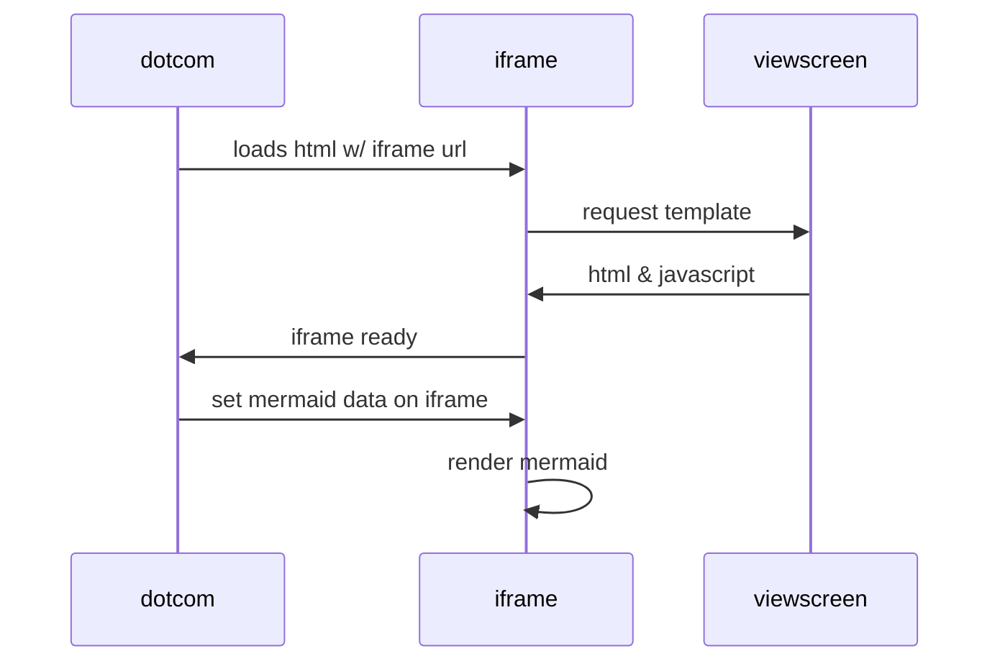

# ASampleClass Class

This is a class description SomeDto .

**Copyright** 

All rights reserved. Cesar Parra 2025

**Mermaid** 



**See** SomeDto

**See** SampleInterface

## Methods
### `getActiveSurveySettings(surveyType2)`

Some description

#### Signature
```apex
public static Map<String,Object> getActiveSurveySettings(String surveyType2)
```

#### Parameters
| Name | Type | Description |
|------|------|-------------|
| surveyType2 | String | my value |

#### Return Type
**Map&lt;String,Object&gt;**

whatever

---

### `someMethod()`

#### Signature
```apex
public static List<String> someMethod()
```

#### Return Type
**List&lt;String&gt;**

---

### `sampleMethod(argument)`

Executes commands based on the passed in argument.

#### Signature
```apex
public static String sampleMethod(List<String> argument)
```

#### Parameters
| Name | Type | Description |
|------|------|-------------|
| argument | List&lt;String&gt; |  |

#### Return Type
**String**

---

### `call()`

Calls the method. 
This methods allows you to call it.

#### Signature
```apex
public static void call()
```

#### Return Type
**void**