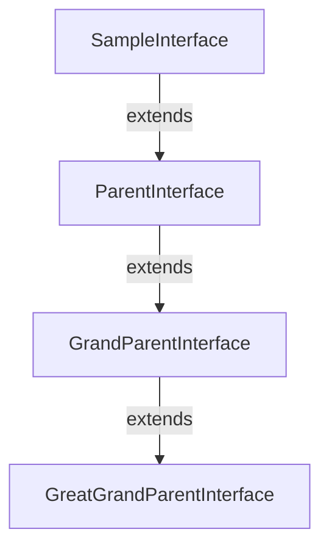

# SampleInterface

`NAMESPACEACCESSIBLE`

This is a sample interface

**Extended types**

[ParentInterface](./ParentInterface.md)

**Author** John Doe

**Date** 2020-01-01

**See** [SampleEnum](../Sample-Enums/SampleEnum.md)

**See** [ReferencedEnum](./ReferencedEnum.md)

## Methods
### `public String sampleMethod()`

`NAMESPACEACCESSIBLE`

This is a sample method

#### Returns

|Type|Description|
|---|---|
|`String`|String|

### `public String sampleMethodWithParams(String param1, Integer param2)`

`NAMESPACEACCESSIBLE`

This is a sample method with parameters

#### Parameters

|Param|Description|
|---|---|
|`param1`|This is the first parameter|
|`param2`|This is the second parameter|

#### Returns

|Type|Description|
|---|---|
|`String`|String|

---
