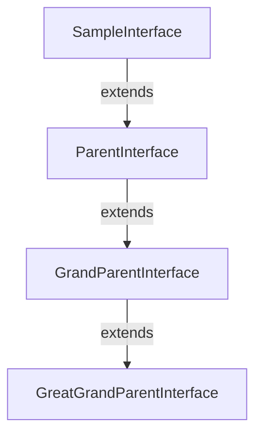

# SampleInterface Interface

`NAMESPACEACCESSIBLE`

This is a sample interface

**Author** John Doe

**Date** 2020-01-01

**See** [apexdocs.SampleEnum](./apexdocs.SampleEnum.md)

**See** [apexdocs.ReferencedEnum](./apexdocs.ReferencedEnum.md)

## Namespace
apexdocs

## Diagram


## Example
```apex
SampleInterface sampleInterface = new SampleInterface();
sampleInterface.sampleMethod();
```

**Extends**
[apexdocs.ParentInterface](./apexdocs.ParentInterface.md)

## Methods
### `sampleMethod()`

`NAMESPACEACCESSIBLE`

This is a sample method

**Custom Tag** 

This is a custom tag

**Another Custom Tag** 

This is another custom tag

#### Signature
```apex
public String sampleMethod()
```

#### Return Type
**String**

Some return value

#### Throws
[apexdocs.SampleException](./apexdocs.SampleException.md): This is a sample exception

AnotherSampleException: This is another sample exception

#### Diagram


#### Example
```apex
SampleInterface sampleInterface = new SampleInterface();
sampleInterface.sampleMethod();
```

---

### `sampleMethodWithParams(param1, param2, theEnum)`

`NAMESPACEACCESSIBLE`
`DEPRECATED`

#### Signature
```apex
public SampleEnum sampleMethodWithParams(String param1, Integer param2, SampleEnum theEnum)
```

#### Parameters
| Name | Type | Description |
|------|------|-------------|
| param1 | String |  |
| param2 | Integer |  |
| theEnum | [apexdocs.SampleEnum](./apexdocs.SampleEnum.md) |  |

#### Return Type
**[apexdocs.SampleEnum](./apexdocs.SampleEnum.md)**

---

### `sampleParentMethod()`

*Inherited*

#### Signature
```apex
public void sampleParentMethod()
```

#### Return Type
**void**