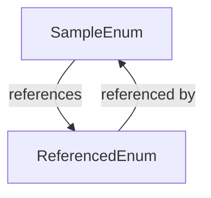

# SampleEnum Enum

`NAMESPACEACCESSIBLE`

This is a sample enum. This references [apexdocs.ReferencedEnum](../Miscellaneous/apexdocs.ReferencedEnum.md) . 

This description has several lines

**Some Custom** 

Test. I can also have a [apexdocs.ReferencedEnum](../Miscellaneous/apexdocs.ReferencedEnum.md) here. 

And it can be multiline.

**Group** Sample Enums

**Author** John Doe

**Date** 2022-01-01

**See** [apexdocs.ReferencedEnum](../Miscellaneous/apexdocs.ReferencedEnum.md)

## Namespace
apexdocs

## Diagram

## Values
| Value | Description |
|-------|-------------|
| VALUE1 | This is value 1 |
| VALUE2 | This is value 2 |
| VALUE3 | This is value 3 |